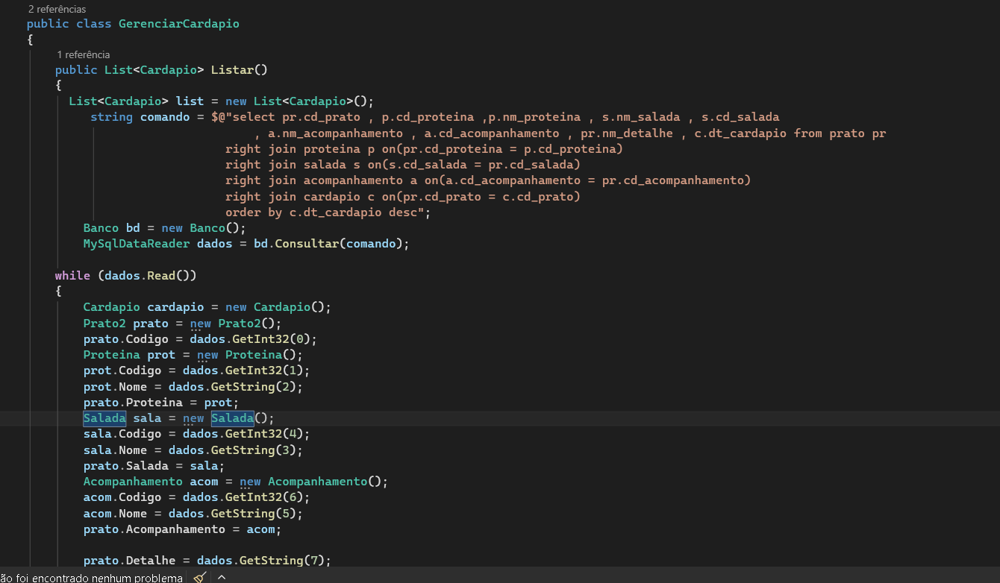
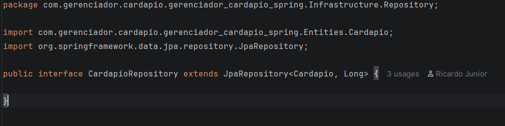
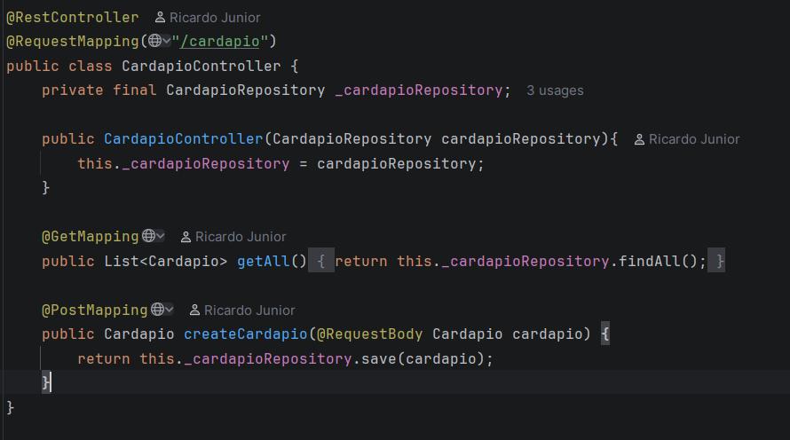

# Gerenciador de Cardápio

Projeto desenvolvido originalmente como uma prova do 2º ano do curso técnico em **C#** e posteriormente refeito do zero com tecnologias modernas, incluindo **Node.js** e **Spring Boot**.

O objetivo deste repositório é registrar a evolução técnica do projeto, mostrando a diferença entre a implementação original e a versão atualizada, mais organizada, escalável e alinhada com boas práticas de desenvolvimento.

---

## Sobre o projeto

O **Gerenciador de Cardápio** é uma aplicação voltada ao controle e gerenciamento de itens de cardápio, permitindo organizar dados de forma prática e eficiente.

A versão original foi criada durante o curso técnico, com foco acadêmico.  
Mais tarde, decidi refazer o projeto como forma de aprendizado e evolução, aplicando conceitos mais atuais de arquitetura, persistência e organização de código.

---

## Evolução do projeto

### Versão original
- Desenvolvida em **C#**
- Criada durante uma prova do curso técnico
- Estrutura mais simples e voltada ao contexto acadêmico
- Implementação manual em algumas partes da persistência

### Versão reescrita
- Recriada com **Node.js**
- Reimplementada também com **Spring Boot**
- Melhor organização de código
- Separação mais clara entre camadas
- Uso de **ORM** para facilitar a persistência de dados
- Estrutura mais próxima de um projeto real de mercado

---

## Tecnologias utilizadas

### Versão original
- C#
- SQL

### Versão atualizada
- Node.js
- Spring Boot
- Java
- ORM
- Banco de dados relacional

---

## Aprendizados

Esse projeto me permitiu comparar na prática duas formas de desenvolver a mesma solução:

- **Fazer a persistência manualmente**
- **Usar ORM para simplificar e organizar o acesso ao banco**

Com isso, foi possível perceber vantagens como:
- menos código repetitivo
- maior produtividade
- manutenção mais fácil
- melhor organização da aplicação
- redução de erros em consultas e mapeamento de dados

---

## Comparação entre ORM e implementação manual

Abaixo você pode inserir prints mostrando a diferença entre as abordagens:

